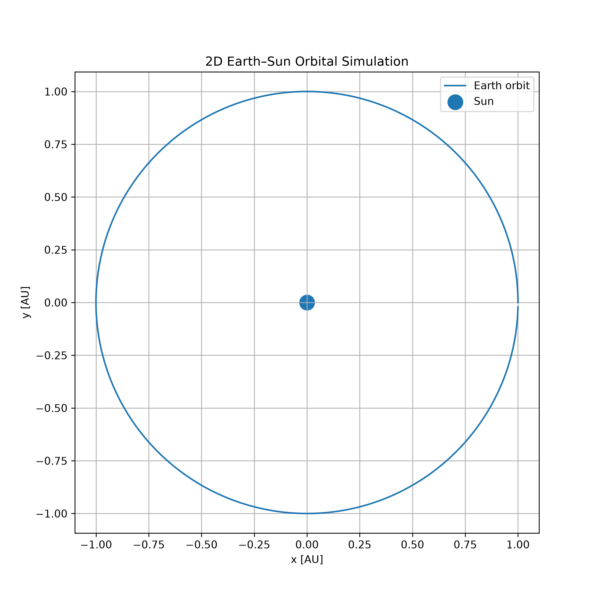
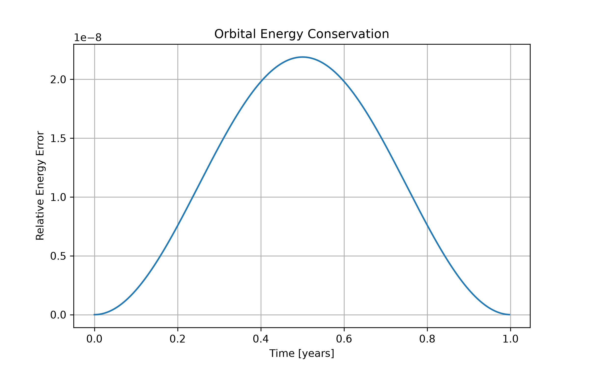
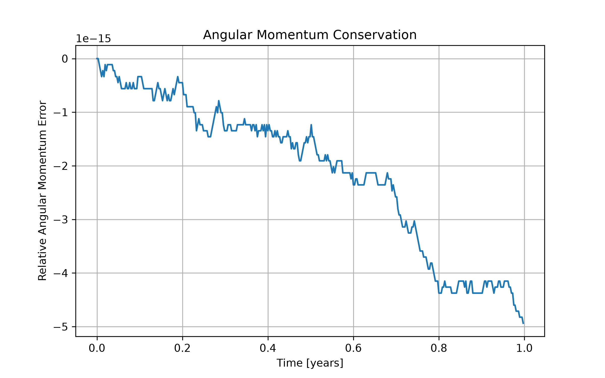

# Orbital Mechanics Simulator

A 2D physics-based orbital mechanics simulator written in Python.

The simulator numerically models gravitational motion and demonstrates how numerical integration can be used to simulate planetary orbits.

## Features

- 2D Newtonian gravitational dynamics
- Earth–Sun orbital simulation
- Velocity Verlet numerical integration
- Orbital energy calculation
- Angular momentum calculation
- Energy conservation analysis
- Angular momentum conservation analysis
- Matplotlib visualisations

## Physics

The gravitational acceleration is calculated using

\[
\mathbf{a} =
-\frac{GM}{r^3}\mathbf{r}.
\]

The simulator uses the Velocity Verlet method to numerically integrate the equations of motion.

The total mechanical energy is

\[
E = \frac{1}{2}mv^2-\frac{GMm}{r}.
\]

For an isolated orbit, the total energy should remain approximately constant.

The z-component of angular momentum is

\[
L_z = m(xv_y-yv_x).
\]

Angular momentum should also remain approximately conserved.

## Results

### Earth–Sun Orbit



### Energy Conservation



### Angular Momentum Conservation



## Project Structure

```text
orbital-mechanics-simulator/
│
├── orbital_mechanics/
│   ├── __init__.py
│   └── simulator.py
│
├── examples/
│   └── orbit_demo.py
│
├── earth_sun_orbit.png
├── orbital_energy.png
├── angular_momentum.png
├── requirements.txt
├── .gitignore
├── README.md
└── LICENSE